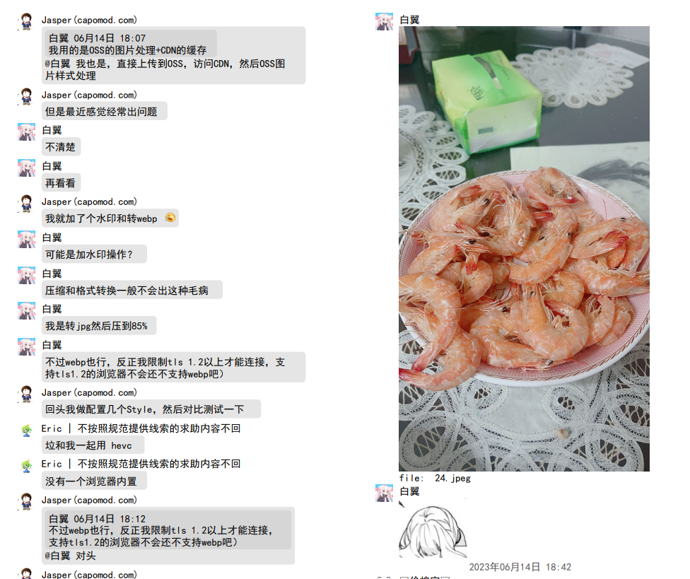
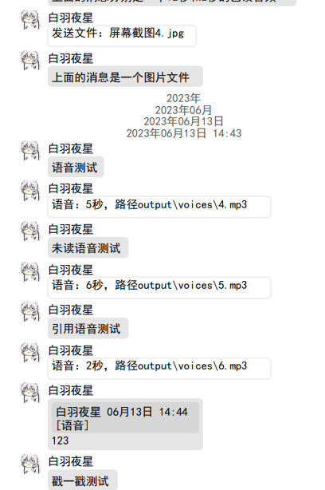
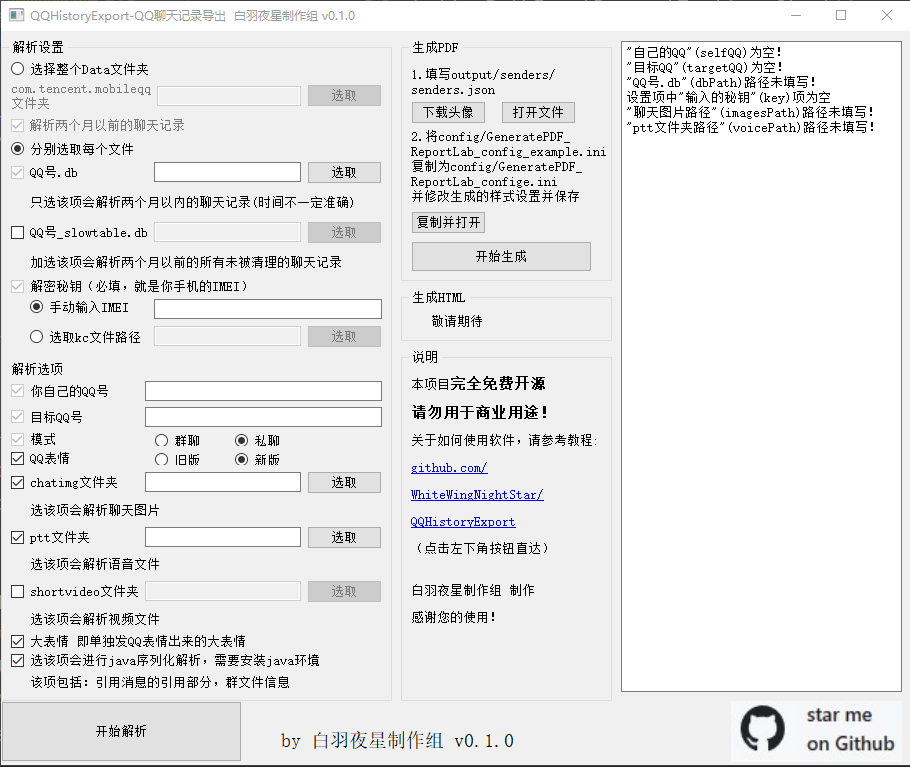
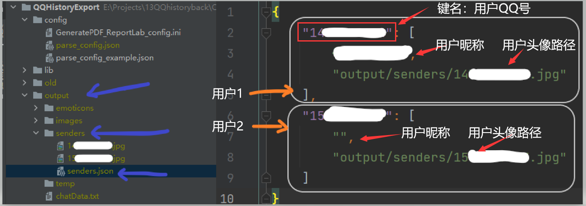
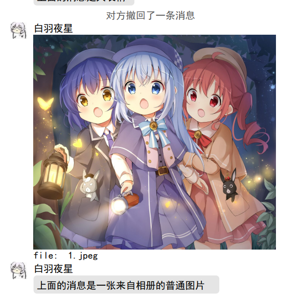
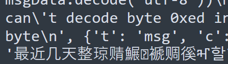

# QQHistoryExport

安卓设备聊天记录导出，支持图片/视频/音频/引用/文件 大部分消息，支持几乎所有的重要消息类型，支持PDF导出，未来将支持html导出

## 前言

本项目的消息解密，数据库读取，QQ表情（emoticon1）来自[Yiyiyimu/QQ-History-Backup](https://github.com/Yiyiyimu/QQ-History-Backup)，感谢为QQ聊天记录解析的一众大佬

本项目支持更多（大部分重要的消息类型）解析了java序列化类型消息，支持PDF导出，未来将支持html导出。

## features

-  支持对话，群聊导出
-  支持自动查找密钥
-  自动合并 db 和 slow-table
-  支持新旧 QQ emoji
- 支持混合消息，图片消息

以上功能来自[Yiyiyimu/QQ-History-Backup](https://github.com/Yiyiyimu/QQ-History-Backup)

以下为本项目独立实现的功能

消息解析：

- 支持**引用消息**
- 支持**视频消息**，自动生成缩略图
- 支持**音频消息**，自动转码为mp3
- 支持**文件类型消息**
- 支持大部分**灰条消息**（包括但不限于 撤回 修改群名称 获得群标签 戳一戳 语音通话）
- 支持**QQ大表情**（marketFace）gif图片导出
- 支持读取**好友表，群聊表，群友表**数据库
- 文件资源自动提取复制到output
- 图片自动猜测类型并md5防重复
- 支持java序列化类型消息解析
- 支持extStr解析，获取了**消息的更多属性**
- 有**GUI界面**

PDF生成：

- 自动通过网络接口获取头像
- 支持导出带**书签**带**头像**带**时间**带**页脚**的PDF文件
- PDF中的媒体文件会有注释文件路径
- 自己写的**排版引擎**，在（混合消息）PDF的文字中方便的放入QQemoji，图片等
- PDF**可设置**间距大小栏数，字体大小，是否显示头像等等
- PDF生成支持**彩色emoji**

效果图：










## 使用说明

### 0.有关测试

目前该仓库处于私有仓库测试阶段

先修改main函数的测试部分到你需要的测试部分，再测试

### 1.下载软件

[Releases · WhiteWingNightStar/QQHistoryExport (github.com)](https://github.com/WhiteWingNightStar/QQHistoryExport/releases)

在这里下载编译好的软件，目前只编译Windows版本，python编译版本3.8，理论上支持win7

建议系统：win10 win11

放在一个没有中文路径的目录防止出错，exe和lib，resourse都要解压出来。

### 2.提取文件

#### 根目录

根目录：**data/data/com.tencent.mobileqq**

方案一：（有root）直接提取出来整个文件夹并填写目录即可

方案二：（有root）只提取以下三个文件,和上述方法的效果是一样的

```
data/data/com.tencent.mobileqq/databases/{你的QQ号}.db
data/data/com.tencent.mobileqq/databases/slowtable_{QQ}.db
//下面这一项其实是手机IMEI码，你也可以不提取这个，直接将IMEI码输入程序
data/data/com.tencent.mobileqq/files/kc
```

**请注意！**有root的用户若安装了某些xsposed框架，或者手机系统给QQ“空白通行证”，或者其它一些原因，QQ可能读不到真正的IMEI，你填你真正的IMEI无法解密，以kc文件为准！

方案三：（无root）通过手机备份功能拿出QQ的数据，里面有db，f等文件夹，不需要重命名，直接输入程序即可

#### 内部存储

内部存储：**Android/data/com.tencent.mobileqq/Tencent/MobileQQ/**

该目录不需要root权限，按需提取：

```
图片文件：上述目录/chatpic/chatimg（文件夹）
视频文件：上述目录/shortvideo（文件夹）
语音文件：上述目录/{你的QQ号}/ptt(文件夹）
```

### 2.运行程序

本程序目前提供了基于PyQt5的UI。可以直接通过UI设置解析。

UI可以从`config/parse_config.json`中读取设置项，加载到UI上，解析后也会保存到这个文件里面。你可以在GUI未运行的时候手动修改该文件。点击GUI的解析按钮，会覆盖该文件。

建议使用纯ANSCII路径（纯英文数字或anscii符号），防止出现问题。

也可以复制`config/parse_config_example.json`到`config/parse_config.json`，有设置项检验程序。

**注意：解析回复的原消息部分，解析群文件信息，需要用户安装java环境。**

命令行输入`java -version`检查java环境是否安装成功。

### 3.生成PDF

接下来可以运行自动下载头像，将会访问QQ接口下载头像。

你也可以不运行这个，自己导入头像图片或者不用头像。

解析完毕后，会生成一个output文件夹，里面的chatData.txt即为符合`docs/output格式.md`的解析完的聊天数据。

里面有一个文件夹senders。senders/senders.json现在是这个样子。每一个键是一个用户。

格式为：{用户QQ号:[用户昵称, 用户头像路径]}



你也可以自己编辑这个senders/senders.json，而不使用接口下载头像，或者如果你不想用从数据库里提取出来的昵称，也要修改这个文件。

**注意！头像的路径是相对于项目根目录的相对路径！**

**注意！目前friend模式无法获取用户自身的昵称，需要你修改这个文件，将你的昵称填进去！**

请勿破坏JSON格式。修改完后记得保存


生成PDF目前支持A4和A5两种大小，可以设置一栏，两栏，三栏，间距什么的都可以设置。请将config/GeneratePDF_ReportLab_config_example.ini复制为config/GeneratePDF_ReportLab_confige.ini并修改生成的样式设置并保存（GUI可以一键复制打开）

因为没找到判断收藏里发出来的表情的方法，目前是将50K以下的图片按照表情的大小生成。这个阈值也可以在设置里调整。




### 4.常见错误排除

1.一直说群组，好友不存在：可能是key错误，解密出来的数据不对

2.一直触发“预期外的错误”，检查parse_log.txt若出现大量的unicode cant decode ,Error parsing ，json错误等，看里面的汉字信息，能发现：



类似的前几个字对，后几个字不对，或者似对非对，可能是key有偏差，**kc文件可能是utf-8，用记事本复制出来可能不行！**建议直接读kc文件！！

如果全乱码的话，就是key错了啦

3.PDF生成大规模错误，或者头像不显示，很可能是设置有问题，请检查设置。

出问题先检查设置！！！出问题先检查设置！！！出问题先检查设置！！！

3.选了图片但是解析后没有图片

请注意，选择chatpic/chatimg文件夹而不是chatpic！若您强力清过手机，可能一些图片会被清掉，也可能未接收。

### 5.Q & A

1.PDF文档中，相同的图片只会保存一次吗？

是的，PDF内只会保存一次

2.我想打包带走，需要带走哪些文件

只想带走PDF的话，只带走PDF文件即可，建议带上output/videos，output/images，output/vioces。PDF文档中相关的文件都有路径文本，您按照您的选择携带媒体文件，不用带chatimg，shortvideo等您从手机里提取出来的文件夹。

3.我想自己写生成其它格式的文件，该怎么办

运行解析后，查看下面项目原理-解析章节。依旧只用在output目录下操作，不用再管您从手机里提取出来的一大堆东西。

### 5.上报问题

欢迎上报问题，因为此项目功能数量多，功能分散，测试样本具有局限性，开发时间跨度大，难以保证每行代码都没问题，各位遇到问题积极提出Issue，有能力的可以直接提pr。

解析的同时会生成一个output/parse_log.json，里面有所有的解析出错数据，上报时请找到bug有关的日志行。**此文件可能含有敏感信息**，请不要复制整个日志文件。若此聊天记录非常敏感，请勿发到issue，若您觉得信息不宜公开但是也并不特别私密，可以发到我们的邮箱mailto:WhiteWingNightStar@outlook.com。 因为日志里看到是乱码，解密后就能看到原数据了。**不用附带IMEI等信息。**您在提issue时需要先尝试最新的release，注明所用软件版本，系统环境，日志等。

若您并不是用的release，需要注明python版本。

若pdf导出出错，建议上报问题，PDF导出的错误目前直接输出在UI里。里面的敏感信息是明文，您可以

## 项目原理

### 说明

因为此项目功能数量多，功能分散，测试样本具有局限性，开发时间跨度大，我自己水平和时间也很有限，代码写的比较烂。各位多多指教。

### 项目结构

```
config:设置，设置样本文件
	GeneratePDF_ReportLab_config_example.ini:ini格式的PDF生成配置样例文件，请勿修改
	parse_config_example.json:json格式的PDF生成配置样例文件，请勿修改

lib:依赖库
	javaDeserialization:java反序列化程序jar
	ffmpeg-lgpl:ffmpeg的lgpl bulid
	
resources:资源文件
	emoticons:QQ表情资源文件
        emoticon1:QQ小表情
        emoticon2:QQ大表情
        nudgeaction:戳一戳等表情（还未投入使用）
	fonts:字体
	
scripts:独立脚本
	colorEmojiImage:将文件夹中unicode emoji表情图片合并成一个文件并创建信息数据库
	fontQuerySize:通过PIL查询字体宽高比并存入字体信息数据库
	nudgeactionResDownload:下载nudgeaction类型图片（还未投入使用）
	
src:主程序
	errcode:错误管理模块
	dataParsing:数据解析模块
		parsing.py:总解析模块
		textParsing.py:文本信息解析
		unserializedDataParsing.py:未序列化类型数据解析
		javaSerializedDataParsing.py:java序列化类型数据解析
		protoDataParsing.py:protobuf序列化类型解析
	proto:proto反序列化相关文件
	javaDeserialization:java反序列化程序源码
	generate:生成可视文件图片
		GeneratePDF_ReportLab.py:使用ReportLab生成PDF
	GUI:GUI模块
		res:资源文件夹
		GUI.py:GUI操作文件
		mainInterface.py:由pyuic5生成的界面代码
		mainInterface.ui:由QtDesigner绘制的界面
		res_rc.py:由pyrcc5生成的资源文件代码
	validateSettings:设置项验证模块
	avatarDownload:通过接口下载头像模块
		
```

### GUI

GUI使用PyQt5。使用Qtdesinger设计，使用pyrcc5和pyric5生成代码。

我不太会用PyQt，请多多指教。

生成GUI：

```shell
pyuic5 src/GUI/maininterface.ui -o src/GUI/maininterface.py
```
生成好的py程序要改一下：

```python
import res_rc
# 改为
import src.GUI.res_rc
```

我这个pyric5会把`import res_rc`生成到整个代码的最后一句，若没找到，往后面找找

有程序的GUI控件都有名字，没程序的就是label_12345

### 解析

解析QQ聊天记录本地数据库，目前只支持安卓。

因为历史原因，QQ聊天记录结构复杂多样~~（屎山）~~，分析难度很高，各种序列化模式混用，有protobuf，json，java序列化或是字符串分隔。所以解析代码写的很长。

~~吐槽：为什么QQ的数据库里，群组是group啊~~

具体的分析，请看这几篇博客：

[QQ安卓端聊天记录数据分析 一 | 寄东南のBlog (sendtosoutheast.github.io)](https://sendtosoutheast.github.io/2022/07/29/逆向分析/QQ聊天记录/qqhistory1/)

[QQ安卓端聊天记录数据分析 二 | 寄东南のBlog (sendtosoutheast.github.io)](https://sendtosoutheast.github.io/2022/11/09/逆向分析/QQ聊天记录/qqhistory2/)

[QQ安卓端聊天记录数据分析 三 | 寄东南のBlog (sendtosoutheast.github.io)](https://sendtosoutheast.github.io/2022/11/24/逆向分析/QQ聊天记录/qqhistory3/)

解析完毕后，会生成一个output文件夹，里面的chatData.txt即为符合`docs/output格式.md`的解析完的聊天数据。里面的路径指向以下资源的相对路径。

```
emoticons文件夹是依赖的表情，只会将用到的复制到output中
images文件夹是聊天图片
senders文件夹是发送者相关信息，若使用自动获取头像，将会修改这里的信息
videos文件夹是聊天视频资源，里面有一个文件夹thumbs，是使用ffmpeg生成的缩略图
voices文件夹是语音，使用slik_v3_decoder和ffmpeg转码为了mp3
```

你可以参考`docs/output格式.md`，写其它生成脚本，欢迎贡献代码。

### 导出

目前写完了PDF导出，基于reportLab：

[QQ安卓端聊天记录数据分析 四 | 寄东南のBlog (sendtosoutheast.github.io)](https://sendtosoutheast.github.io/2023/06/12/逆向分析/QQ聊天记录/qqhistory4/)

有计划完成web导出。

## TODO

说明：因为此项目功能数量多，功能分散，测试样本具有局限性，开发时间跨度大，难以保证每行代码都没问题，各位遇到问题积极提出Issue，有能力的可以直接提pr

- [ ] web导出
- [x] 音频消息导出
- [x] 视频消息导出
- [x] PDF生成程序的错误处理
- [x] 程序UI
- [x] 使用说明
- [ ] 支持卡片消息
- [x] 完善错误管理
- [ ] 添加多几种emoji表情供选择
- [ ] 增加PDF绘制图片自定义尺寸，非统一管理缩放
- [x] 明确设置群组好友格式，防止QQ群号和用户号重复
- [ ] 红包解析
- [ ] java序列化进程管理
- [x] 解析进度条（暂且做成文字百分比提示）


## 局限性

### 消息解析

- [ ] 一个消息的总ERRCODE只支持一个，可能遇到不足的问题

- [ ] 灰条消息（撤回，获得群荣誉，修改群名等等等）直接从protobuf提取出来的字符串，可能存在“icon”等字符（可以通过解析extStr中的html解决，但挺费力）

- [ ] 灰条消息（撤回，获得群荣誉，修改群名等等等）直接从protobuf提取出来的字符串，相关人员的名称使用的可能是当时的昵称，无法自由配置（可以通过解析extStr中的html解决，但挺费力）

- [ ] json格式的卡片消息类型较多（参考：[QQ发送卡片消息 - 言成言成啊 - 博客园 (cnblogs.com)](https://www.cnblogs.com/meethigher/p/13581506.html)），难以提取出关键信息

- [ ] 无法解析合并转发消息的第二层序列化，入群消息（xx座男一枚，xxxx这种）

- [ ] 视频解析因为会清理，若视频被清理了就找不到视频了，然而QQ的shortvideo/thumb下的缩略图因分析不出命名规则，无法使用这缩略图

- [ ] 转发的聊天记录的序列化方式是java序列化+其它，无法分析，解析

- [ ] 解析时抛弃了一些属性，若有需要可修改，提交pr

  

### PDF生成

- [ ] 灰条消息没有写换行
- [ ] 没有错误处理
- [ ] 排版引擎在计算字体宽度时大约有3%的误差，略不美观，望大佬指点

## 作者

白羽夜星制作组 制作

<table>
    <tr>
        <td align="center">
            <a href="https://github.com/WhiteWingNightStar">
                
                <br />
                <sub><b>白羽夜星制作组</b></sub>
            </a>
        </td>
        <td align="center">
            <a href="https://github.com/SendToSouthEast">
                
                <br />
                <sub><b>寄东南</b></sub>
            </a>
        </td>
        <td align="center">
            <a href="https://github.com/ahzvenol">
                
                <br />
                <sub><b>灵弦</b></sub>
            </a>
        </td>
    </tr>
</table>


## license

***由于本项目的特殊性质，本项目禁止一切形式的商业用途。***

***由于本项目的特殊性质，本项目禁止一切形式的商业用途。***

***由于本项目的特殊性质，本项目禁止一切形式的商业用途。***

## 感谢

本项目的本消息解密，数据库读取，QQ表情（emoticon1），来自：

https://github.com/Yiyiyimu/QQ_History_Backup

https://github.com/roadwide/qqmessageoutput

https://gist.github.com/WincerChan/362331456a6e0417c5aa1cf3ff7be2b7

消息反序列化分析用到了：

https://github.com/protocolbuffers/protobuf

https://github.com/nccgroup/blackboxprotobuf（测试阶段使用，不在项目代码中）

https://github.com/rohankumardubey/SerializationDumper（测试阶段使用，不在项目代码中）

音频转码用到了：

https://github.com/kn007/silk-v3-decoder

https://github.com/FFmpeg/FFmpeg （LGPL bulid）

视频缩略图用到了：

https://github.com/FFmpeg/FFmpeg （LGPL bulid）
