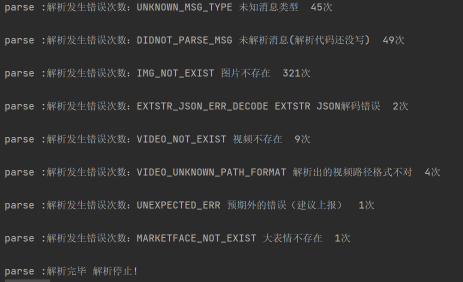
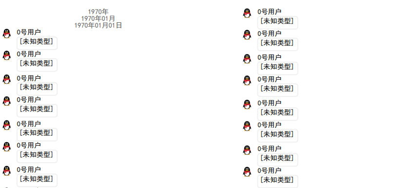

# QQHistoryExport

安卓设备QQ聊天记录导出，支持图片/视频/音频/引用/文件 大部分消息，支持几乎所有的重要消息类型，支持PDF导出，未来将支持html导出

## 前言

本项目的消息解密，数据库读取，QQ表情（emoticon1）来自[Yiyiyimu/QQ-History-Backup](https://github.com/Yiyiyimu/QQ-History-Backup)，感谢为QQ聊天记录解析的一众大佬

本项目支持更多（大部分重要的消息类型），解析了java序列化类型消息和更多的protobuf序列化消息，支持PDF导出，未来将支持html导出。相比于网上的闭源软件，多了很多功能。

网上搜的大多数文章和软件都浅尝辄止，或者收费，本项目开源免费，希望能帮助大家。


## Features

-  支持对话，群聊导出
-  支持自动查找密钥
-  自动合并 db 和 slow-table
-  支持新旧 QQ emoji
- 支持混合消息，图片消息

以上功能来自[Yiyiyimu/QQ-History-Backup](https://github.com/Yiyiyimu/QQ-History-Backup)

以下为本项目实现的功能

消息解析：

- 支持**引用消息**
- 支持**视频消息**，自动生成缩略图
- 支持**音频消息**，自动转码为mp3
- 支持**文件类型消息**
- 支持大部分**灰条消息**（包括但不限于 撤回 修改群名称 获得群标签 戳一戳 语音通话）
- 支持**QQ大表情**（marketFace）gif图片导出
- 支持读取**好友表，群聊表，群友表**数据库
- 文件资源自动提取复制到output
- 图片自动猜测类型并md5防重复
- 支持java序列化类型消息解析
- 支持extStr解析，获取了**消息的更多属性**
- 有功能丰富的**GUI界面**

PDF生成：

- 自动通过网络接口获取头像
- 支持导出带**书签**带**头像**带**时间**带**页脚**的PDF文件
- PDF中的媒体文件会有注释文件路径
- 自己写的**排版引擎**，在（混合消息）PDF的文字中方便的放入QQemoji，图片等
- PDF**可设置**间距大小栏数，字体大小，是否显示头像等等
- PDF生成支持**彩色emoji**

效果图：


## 使用说明

您需要准备一台windows电脑，在release里下载软件，然后需要通过root/手机备份的方式拿出手机的QQ数据。

大概需要提取：

根目录：**data/data/com.tencent.mobileqq**

提取整个目录或者里面的主要文件，详见使用说明

内部存储：**Android/data/com.tencent.mobileqq/Tencent/MobileQQ/ 按需提取：

```
图片文件：上述目录/chatpic/chatimg（文件夹）
视频文件：上述目录/shortvideo（文件夹）
语音文件：上述目录/{你的QQ号}/ptt(文件夹）
```

移动到电脑上，然后运行本项目。下面是详细说明。若你看不懂，建议找一个懂电脑或者手机的朋友。


***重要通知：本项目不支持NT版本。近日，一些自动更新的手机已更新为QQNT版本，8.9.63即以上即为NT版本。若需要提取聊天记录，请勿更新！请勿更新！2023年9月24日***

有关QQNT，请参看：https://github.com/Young-Lord/QQ-History-Backup/issues/9（YoungLord等人已分析数据库加密方式，需要HOOK）

现在好像还没有开源项目能解析QQNT数据结构

项目主要开发者比较忙，短期内没有支持QQNT的打算

===================

## ==[使用教程](docs/使用教程.md)==

===================

## Q & A

<u>1.PDF文档中，相同的图片只会保存一次吗？</u>

是的，PDF内只会保存一次

<u>2.我想打包带走，需要带走哪些文件？</u>

只想带走PDF的话，只带走PDF文件即可，建议带上output/videos，output/images，output/vioces。PDF文档中相关的文件都有路径文本，您按照您的选择携带媒体文件，不用带chatimg，shortvideo等您从手机里提取出来的文件夹。

<u>3.我想自己写生成其它格式的文件，该怎么办？</u>

运行解析后，查看下面项目原理-解析章节。依旧只用在output目录下操作，不用再管您从手机里提取出来的一大堆东西。

<u>4.他报出来的错误很多，怎么办？多少是不正常？</u>

这是我一个八万条聊天记录导出的错误统计



<u>5.不会用怎么办？</u>

找一个懂电脑的人帮你。

我写了五千字的文档了已经。

<u>6.消息开始有一段这个？</u>



怎么会逝？我也不知道，x逊的QQ数据库就是屎山！！！！！我这边只有20来条，下面的就是正常消息

## 上报问题

欢迎上报问题，因为此项目功能数量多，功能分散，测试样本具有局限性，开发时间跨度大，难以保证每行代码都没问题，各位遇到问题积极提出Issue，有能力的可以直接提pr。

解析的同时会生成一个output/parse_log.json，里面有所有的解析出错数据，上报时请找到bug有关的日志行。**此文件可能含有敏感信息**，请不要复制整个日志文件。若此聊天记录非常敏感，请勿发到issue，若您觉得信息不宜公开但是也并不特别私密，可以发到我们的邮箱Hakuuyosei@outlook.com。 因为日志里看到是乱码，解密后就能看到原数据了。**不用附带IMEI等信息。** 您在提issue时需要先尝试最新的release，注明所用软件版本，系统环境，日志等。

若您直接将数据库文件发送过来（不建议），需要附带IMEI（以kc文件为准），你自己的QQ号，你的目标QQ号。

若您并不是用的release，需要注明python版本。

若pdf导出出错，建议上报问题，PDF导出的错误目前直接输出在UI里。里面的敏感信息是明文，您可以将敏感信息替换后提issue。

此外，请查看TODO：[TODO](#todo)

## 项目原理/贡献说明

本项目交流IM：https://matrix.to/#/#qq_history_export:matrix.org

可使用Element（推荐），SchildiChat，Weechat等client进入（访问链接按照提示操作即可）


=================================

## ==[项目原理/贡献说明](docs/项目说明.md)==

=================================

## TODO

说明：因为此项目功能数量多，功能分散，测试样本具有局限性，开发时间跨度大，难以保证每行代码都没问题，各位遇到问题积极提出Issue，有能力的可以直接提pr

- [ ] 各种品牌详细的导出流程（目前小米已完毕）此处需要各位积极提交pr或者写文档我给写进去：[提取教程](docs/提取教程.md)
- [ ] web导出
- [x] 音频消息导出
- [x] 视频消息导出
- [x] PDF生成程序的错误处理
- [x] 程序UI
- [x] 使用说明
- [ ] 支持卡片消息
- [x] 完善错误管理
- [ ] 添加多几种emoji表情供选择
- [ ] 增加PDF绘制图片自定义尺寸，非统一管理缩放
- [x] 明确设置群组好友格式，防止QQ群号和用户号重复
- [ ] 红包解析
- [x] java序列化进程更好地管理（修改为javaobj）
- [x] 解析进度条（暂且做成文字百分比提示）


## 局限性

### 消息解析

- [ ] 灰条消息（撤回，获得群荣誉，修改群名等等等）直接从protobuf提取出来的字符串，可能存在“icon”等字符（可以通过解析extStr中的html解决，但挺费力）

- [ ] 灰条消息（撤回，获得群荣誉，修改群名等等等）直接从protobuf提取出来的字符串，相关人员的名称使用的可能是当时的昵称，无法自由配置（可以通过解析extStr中的html解决，但挺费力）

- [ ] json格式的卡片消息类型较多（参考：[QQ发送卡片消息 - 言成言成啊 - 博客园 (cnblogs.com)](https://www.cnblogs.com/meethigher/p/13581506.html)），难以提取出关键信息

- [ ] 无法解析合并转发消息的第二层序列化，入群消息（xx座男一枚，xxxx这种）

- [ ] 视频解析因为会清理，若视频被清理了就找不到视频了，然而QQ的shortvideo/thumb下的缩略图因分析不出命名规则，无法使用这缩略图

- [ ] 转发的聊天记录的序列化方式是java序列化+未知，可能是一种xml的二进制序列化实现，无法解析

- [ ] 解析时抛弃了一些属性，若有需要可修改，提交pr

  

### PDF生成

- [ ] 灰条消息没有写换行
- [ ] 没有错误处理
- [ ] 排版引擎在计算字体宽度时大约有3%的误差，略不美观，望大佬指点

## 作者

白羽夜星制作组 制作

<table>
    <tr>
        <td align="center">
            <a href="https://github.com/Hakuuyosei">
                
                <br />
                <sub><b>白羽夜星制作组</b></sub>
            </a>
        </td>
        <td align="center">
            <a href="https://github.com/SendToSouthEast">
                
                <br />
                <sub><b>寄东南</b></sub>
            </a>
        </td>
        <td align="center">
            <a href="https://github.com/ahzvenol">
                
                <br />
                <sub><b>灵弦</b></sub>
            </a>
        </td>
    </tr>
</table>
<a href="https://afdian.net/a/Hakuuyosei"></a>


贡献者：

<table>
    <tr>
        <td align="center">
            <a href="https://github.com/NovaShen555">
                
                <br />
                <sub><b>NovaShen555</b></sub>
            </a>
        </td>
        <td align="center">
            <a href="--">
                
                <br />
                <sub><b>----------------------------------</b></sub>
            </a>
        </td>
        <td align="center">
            <a href="--">
                
                <br />
                <sub><b>-----------------------------------</b></sub>
            </a>
        </td>
    </tr>
</table>


## License

***由于本项目的特殊性质，本项目禁止一切形式的商业用途。***

***由于本项目的特殊性质，本项目禁止一切形式的商业用途。***

***由于本项目的特殊性质，本项目禁止一切形式的商业用途。***

## 感谢

本项目的本消息解密，数据库读取，QQ表情（emoticon1），来自：

https://github.com/Yiyiyimu/QQ_History_Backup

https://github.com/roadwide/qqmessageoutput

https://gist.github.com/WincerChan/362331456a6e0417c5aa1cf3ff7be2b7

消息反序列化分析用到了：

https://github.com/protocolbuffers/protobuf

https://github.com/nccgroup/blackboxprotobuf（测试阶段使用，不在项目代码中）

https://github.com/rohankumardubey/SerializationDumper（测试阶段使用，不在项目代码中）

音频转码用到了：

https://github.com/kn007/silk-v3-decoder

https://github.com/FFmpeg/FFmpeg （LGPL bulid）

视频缩略图用到了：

https://github.com/FFmpeg/FFmpeg （LGPL bulid）

表情：
https://github.com/im0qianqian/QQ-Emoticon

另外感谢：[Young-Lord (LY) (github.com)](https://github.com/Young-Lord)提供的建议和资料
