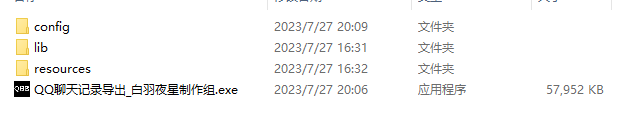
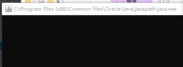
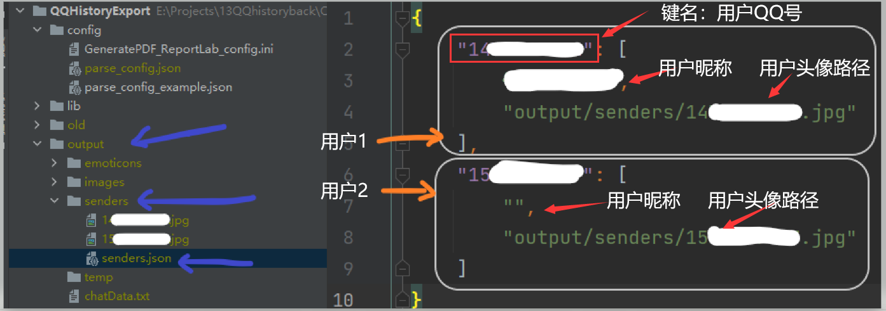
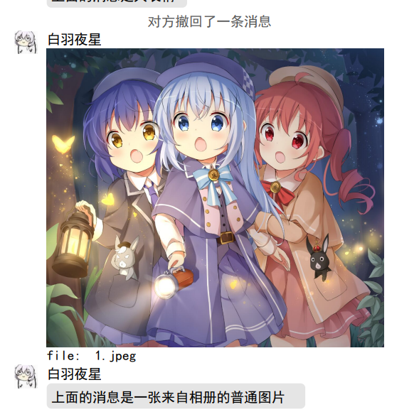
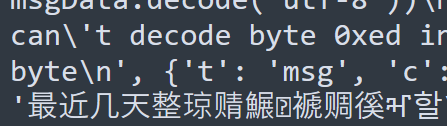
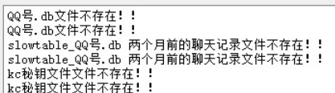
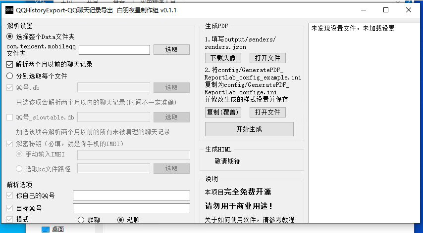

### 1.下载软件

[Releases · Hakuuyosei/QQHistoryExport (github.com)](https://github.com/Hakuuyosei/QQHistoryExport/releases)

在这里下载编译好的软件，目前只编译Windows版本，python编译版本为3.8，理论上支持win7

建议系统：win10 win11

放在一个**没有中文路径的目录**（只有ansii字符）防止出错。把文件解压出来（不要在压缩包里运行！）：



### 2.提取文件

#### 根目录

根目录：**data/data/com.tencent.mobileqq**

方案一：（有root）直接提取出来整个文件夹并填写目录即可

方案二：（有root）只提取以下三个文件,和上述方法的效果是一样的

```
data/data/com.tencent.mobileqq/databases/{你的QQ号}.db
data/data/com.tencent.mobileqq/databases/slowtable_{QQ}.db
//下面这一项其实是手机IMEI码，你也可以不提取这个，直接将IMEI码输入程序
data/data/com.tencent.mobileqq/files/kc
```

**请注意！**有root的用户若安装了某些xsposed框架，或者手机系统给QQ“空白通行证”，或者其它一些原因，QQ可能读不到真正的IMEI，你填你真正的IMEI无法解密，（kc还可能有utf-8字符，大小写也可能不一致）以kc文件为准！

方案三：（无root）通过手机备份功能拿出QQ的数据，里面有db，f等文件夹，不需要重命名，直接输入程序即可

如何提取呢？

**提取教程：**[<font size=10>提取教程</font>](提取教程.md)

#### 内部存储

内部存储：**Android/data/com.tencent.mobileqq/Tencent/MobileQQ/**

该目录不需要root权限，按需提取：

```
图片文件：上述目录/chatpic/chatimg（文件夹）
视频文件：上述目录/shortvideo（文件夹）
语音文件：上述目录/{你的QQ号}/ptt(文件夹）
```

### 2.运行程序

本程序目前提供了基于PyQt5的UI。可以直接通过UI设置解析。

UI可以从`config/parse_config.json`中读取设置项，加载到UI上，解析后也会保存到这个文件里面。你可以在GUI未运行的时候手动修改该文件。点击GUI的解析按钮，会覆盖该文件。

建议使用纯ANSCII路径（纯英文数字或anscii符号），防止出现问题。

也可以复制`resources/config_examples/parse_config_example.json`到`config/parse_config.json`，有设置项检验程序。

**注意：解析回复的原消息部分，解析群文件信息，需要用户安装java环境。**

命令行输入`java -version`检查java环境是否安装成功。

假如你选择了java解析，在运行发行版时，会有一个java窗口：



不要关！不要关！不要关！不要关！不要关！

### 3.生成PDF

接下来可以运行自动下载头像，将会访问QQ接口下载头像。

你也可以不运行这个，自己导入头像图片或者不用头像。

解析完毕后，会生成一个output文件夹，里面的chatData.txt即为符合`docs/output格式.md`的解析完的聊天数据。

里面有一个文件夹senders。senders/senders.json现在是这个样子。每一个键是一个用户。

格式为：JSON：{用户QQ号:[用户昵称, 用户头像路径]}



你也可以自己编辑这个senders/senders.json，而不使用接口下载头像，或者如果你不想用从数据库里提取出来的昵称，也要修改这个文件。

**注意！头像的路径是相对于项目根目录的相对路径！**示例："output/senders/10086.jpg" 建议使用/斜杠

**注意！目前friend模式无法获取用户自身的昵称，需要你修改这个文件，将你的昵称填进去！**

请勿破坏JSON格式。修改完后记得保存


生成PDF目前支持A4和A5两种大小，可以设置一栏，两栏，三栏，间距什么的都可以设置。请将config/GeneratePDF_ReportLab_config_example.ini复制为config/GeneratePDF_ReportLab_confige.ini并修改生成的样式设置并保存（GUI可以一键复制打开）

默认是A4两栏。

因为没找到判断收藏里发出来的表情的方法，目前是将50K以下的图片按照表情的大小生成。这个阈值也可以在设置里调整。




### 4.常见错误排除

<u>1.一直说群组，好友不存在：</u>可能是key错误，解密出来的数据不对

<u>2.一直触发“预期外的错误”，检查parse_log.txt若出现大量的unicode cant decode ,Error parsing ，json错误等，看里面的汉字信息，能发现：</u>



类似的前几个字对，后几个字不对，或者似对非对，可能是key有偏差，**kc文件可能是utf-8，用记事本复制出来可能不行！** 建议直接读kc文件！！

如果全乱码的话，就是key错了啦

<u>3.PDF生成大规模错误，或者头像不显示</u>，很可能是设置有问题，请检查设置。

出问题先检查设置！！！出问题先检查设置！！！出问题先检查设置！！！

<u>4.选了图片但是解析后没有图片</u>

请注意，选择chatpic/chatimg文件夹而不是chatpic！若您强力清过手机，可能一些图片会被清掉，也可能未接收。

<u>5.数据里最开始一段或者某一段只有撤回消息和时间信息，PDF里面看着全是一大片灰条文字。</u>

这就不是我的锅啦！某逊的消息刷新机制很奇怪，灰条消息（撤回）和普通消息的刷新机制不一样，假如你有一段时间没登录QQ或者刚重装QQ，那么灰条消息依然会请求下来，而其它消息不会，本地保存的就只有灰条消息。这个问题在QQ手表版里非常明显。

<u>5.生成PDF后，PDF是0kb？</u>

显示PDF生成成功后，还得再等一会，然后文件才能保存成功，大概不到一分钟。

6.文件夹没选对。应该选择databases/db文件夹的上一层文件夹（com.tencent.mobileqq）



<u>7.窗口不能显示完</u>

可能是你屏幕分辨率太小，显示不完软件，Qt似乎也不会尽量显示，可以点击全屏试试。

