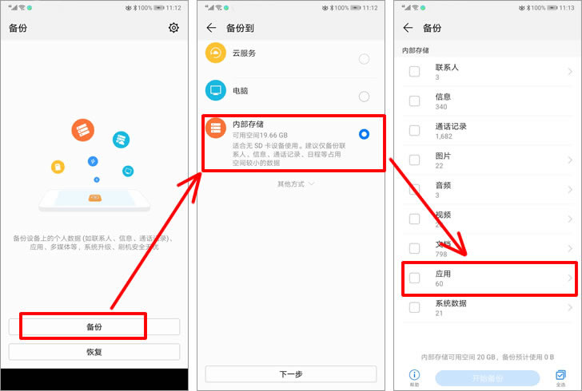

# 提取教程

如果你连root是什么都不知道，建议不要亲自操作，找一个懂IT的朋友！

没root就用没root的方法，别折腾root！可能会导致数据丢失、手机变砖、保修失效！

## 0.资源文件提取

这部分是按需提取，可以不提取。但是建议也读一下。

使用文件管理器（建议使用第三方文件管理器而不是用户自带的），从下面那个内部存储里面找。


强烈建议chatimg，ptt等资源文件夹先打压缩包，再用MTP或者什么方式传到电脑上！！不然会很慢！因为里面可能有几十万个文件！

请确保手机有足够的空间，可以将其它无用的聊天记录先用QQ删除再提取（别点清理图片）


## 1.Root用户提取

赋予文件管理器Root权限（data文件夹需要root权限才能访问），按照README文档的要求提取文件，或者全部提取出来。


建议打一个压缩包（MT管理器是可以长按压缩），放在内部存储的目录中（可以新建一个，随意）

然后手机数据线连接电脑，可以用MTP传上来。


## 2.免Root系统备份法

该方法需要手机有系统的备份软件，大部分主流机型和系统都有（应该吧）

还需要手机有大于QQ占用的大小的空余存储空间。不过提取数据库和资源文件可以分步解决。

流程基本差不多，小米红米的教程是我写的，其它手机也可以参考。

### (1)小米红米

系统备份里搜索“备份”：打开备份和重置


打开本地备份


新建备份


取消全选，在软件程序里面只选择QQ

取消全选，在软件程序里面只选择QQ

取消全选，在软件程序里面只选择QQ

然后开始备份


备份结束后，在目录

```
/storage/emulated/0/MIUI/backup/AllBackup/20230727_xxxxx/
```

/storage/emulated/0/指的就是内部存储，你打开内部存储后找MIUI就行了

20230727是你备份的日期

这个目录下能找到一个bak文件。（演示用，其实不是QQ，大小别在意）


然后将该文件通过MTP或者别的方法传到电脑上。文件可能比较大，传的时间估计不短。

然后解压，建议用7zip。实测3某某压缩有概率会出现奇怪的问题，文件没全解压出来却不报错。

备份文件在手机上可以删的，不会影响QQ。


### (2)华为

以下教程仅供参考，没有华为手机。理论上我们是需要一个Bak文件的，但是这个教程出来是db文件，有华为的可以试一下，看看最新版本的备份出来是不是bak文件。

1，打开华为手机系统自带的备份app，按下图所示点击“备份”，“内部存储”，再点击进入“应用”列表（并非勾选“应用”）。
说明：如果备份app中找不到“内部存储”项的话，说明该手机上安装的是9.0及以后的新版备份软件，需要先在手机中将其卸载，然后安装8.0版的备份软件。请自行搜索下载。



2，在弹出的应用列表窗口中勾选上“QQ”并点击“开始备份”按钮，然后在弹出的设置密码界面不要输入任何密码，直接点击“跳过”按钮。


3，备份结束后，接下来将华为手机用数据线连接到电脑上，进入手机盘符下的“Huawei/Backup/backupFiles/备份时间”文件夹，可看到刚才备份下来的com.tencent.mobileqq.db文件，将其复制并粘贴到电脑上任意文件夹下。


### (3)其它

其它手机大同小异，大多数应该是能整出来的。

请自行在网上搜索。这些年提取QQ聊天记录的软件很多，都可以借鉴参考他们的提取教程。

可以参考红米小米的教程。

## 3.修改AndroidManifest.xml后ADB(高危麻烦)

**若没有玩机经验，请勿尝试**

**若没有玩机经验，请勿尝试**

**若没有玩机经验，请勿尝试**

**若没有玩机经验，请勿尝试**

不一定对所有手机有效，有效性一般。我也没试过。

1. 修改 debuggable 属性： 

   a. 首先，将 AndroidManifest.xml 文件复制到你的计算机上，并确保备份原始文件以防止意外错误。 

   b. 使用文本编辑器（如 Notepad++、Sublime Text 等）打开 AndroidManifest.xml 文件。

   c. 在 `<application>` 标签中找到 `android:debuggable` 属性。它通常看起来像这样：`android:debuggable="true"`。 

   d. 将 `android:debuggable` 的值从 "true" 改为 "false"，如果没有该属性，则添加它并设置为 "false"。 e. 保存 AndroidManifest.xml 文件并将其放回应用程序的源代码位置。

2. 导出应用程序数据： 

   a. 确保你已经将 Android 设备与计算机连接，并且已经安装了 Android SDK 中的 adb 工具。在计算机上配置好 adb 的环境变量，这样你就可以在任意位置执行 adb 命令。 

   b. 打开命令提示符（Windows）或终端（macOS/Linux）。 

   c. 使用以下命令导出应用程序数据：

```
bashCopy code
adb backup -f <文件名>.ab -noapk <包名>
```

- `<文件名>.ab` 是导出数据的文件名，你可以自行指定。
- `<包名>` 是你想要导出数据的应用程序的包名。

例如，如果你要导出包名为 com.tencent.mobileqq 的应用程序数据，并将其保存为 backup.ab 文件，你可以运行以下命令：

```
bashCopy code
adb backup -f backup.ab -noapk com.tencent.mobileqq
```

d. 执行上述命令后，你的 Android 设备屏幕上将显示一个备份确认屏幕。在设备上确认备份操作，允许备份。 e. 备份完成后，你将在当前命令提示符或终端路径中找到备份的文件。

请注意：从 Android 6.0（API 级别 23）开始，Google 引入了备份保护机制，它可能会阻止对某些应用程序的数据执行 adb 备份操作，特别是对于 debuggable 设置为 false 的应用。因此，有些应用程序可能无法通过 adb 进行数据备份。